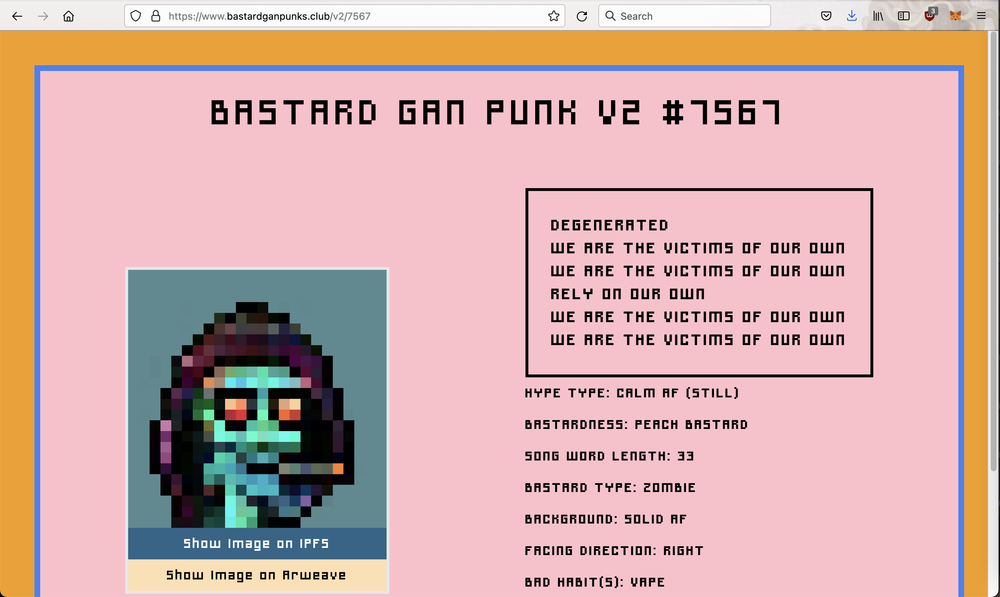
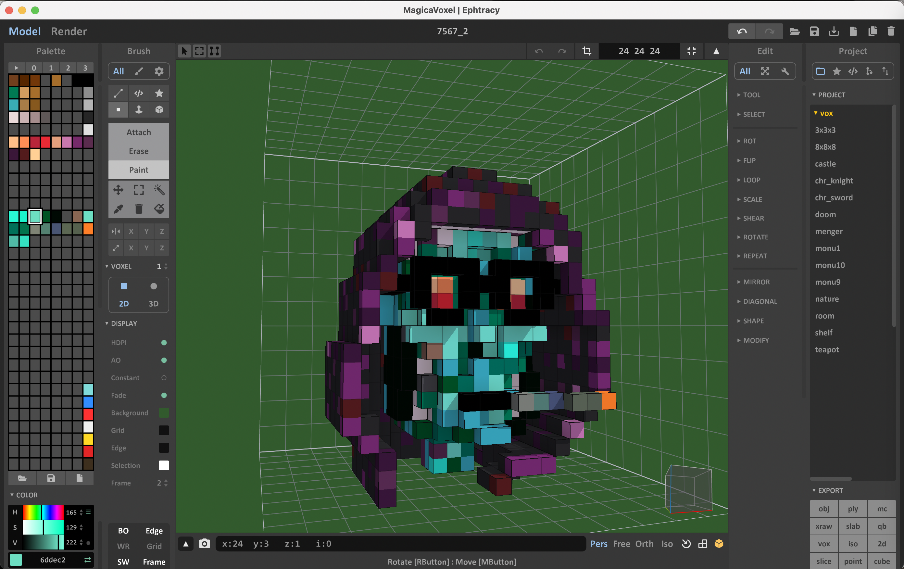

# 3D Children Of Bastard GAN Punk #7567

## Bastard GAN Punk #7567
From [https://www.bastardganpunks.club/v2/7567](https://www.bastardganpunks.club/v2/7567):

<kbd></kbd>

With the following image:

<kbd></kbd>

We have used our [3DVoxelPunk #3983](https://opensea.io/assets/0x495f947276749ce646f68ac8c248420045cb7b5e/10011057856512296296013289979640135050179181920147171282386746784288702726145), based on [CryptoPunk #3983](https://www.larvalabs.com/cryptopunks/details/3983), for inspration in the creation of the #7567 starting template [media/7567_3DTemplate.vox](media/7567_3DTemplate.vox).

When opened in [MagicaVoxels](https://ephtracy.github.io/):

<kbd></kbd>

 

 

Enjoy!

(c) BokkyPooBah / Bok Consulting Pty Ltd - Jul 2021. The MIT Licence. Not affiliated with [https://bastardganpunks.club/](https://bastardganpunks.club/). Some images and data copyright their respective owners. DYOR.
